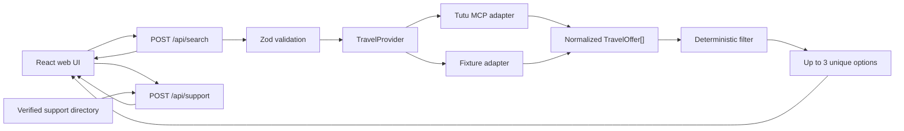

# Успеть

> Тревожная кнопка для пассажира: найти новый билет, который прибывает в нужный город до дедлайна, если исходный рейс отменили или перенесли.

«Успеть» — веб-сервис поиска нового билета, когда важно оказаться в городе к конкретному времени. Пользователь задаёт только текущую точку, город назначения и дедлайн, затем уточняет багаж, пассажиров, бюджет и транспорт. Сервис запрашивает предложения у транспортного провайдера и детерминированно оставляет до трёх разных вариантов, которые прибывают до дедлайна по расписанию.

Форма открывается пустой: пользователь сам задаёт обстоятельства конкретной поездки. Для автоматических проверок используется контрольный сценарий: 19 августа 2026 года, 09:00, Пулково; рейс на 10:30 перенесён на 18:00; в Москве нужно быть до 18:00.

## Бизнес-идея

### Проблема

После срыва рейса пассажир находится в стрессе и вручную сравнивает несколько несвязанных поисков: следующие самолёты, поезда, автобусы и поддержку продавца. Обычный travel-поиск оптимизирует плановую поездку, а не ответ на вопрос «как всё ещё успеть к 18:00».

### Решение

«Успеть» превращает дедлайн в главное ограничение поиска. Сервис:

1. сначала собирает только точку, город назначения и дедлайн;
2. получает реальные транспортные предложения через Tutu MCP;
3. кодом отбрасывает всё, что отправляется слишком рано или прибывает слишком поздно;
4. показывает до трёх действительно разных альтернатив;
5. на отдельном экране даёт до трёх проверенных действий по исходному билету: проверить рейс, разобраться с билетом и открыть информацию точки отправления.

### Для кого

- пассажиры отменённых и перенесённых авиарейсов;
- люди с жёсткой целью прибытия: пересадка, встреча, мероприятие, лечение или работа;
- сопровождающие, которые удалённо помогают родственнику перестроить поездку;
- в перспективе — сотрудники поддержки и тревел-менеджеры.

### Ценность для Туту

- новый deadline-first сценарий поверх нескольких транспортных вертикалей;
- удержание пользователя внутри одного сервиса в момент максимальной потребности;
- дополнительные продажи альтернативных билетов;
- снижение неопределённости и потенциальной нагрузки на поддержку;
- основа для встраиваемого recovery-сценария после уведомления о сбое рейса.

Ключевая метрика MVP — доля поисков, в которых пользователь открыл подходящий билет. Защитные метрики: доля пустых выдач, ошибки источника и число показанных вариантов, которые нарушили дедлайн — последнее всегда должно быть равно нулю.

## Запуск

Требуется Node.js `>=22.13.0`.

```bash
npm install
npm run dev
```

Откройте [http://localhost:3000](http://localhost:3000).

Проверки перед сдачей:

```bash
npm run lint
npm test
```

`npm test` собирает production-версию и проверяет основной сценарий, выдачу с одним и тремя вариантами, маленький запас, невозможный дедлайн, ближайший опоздавший маршрут, строгую точку отправления, валидацию времени, четыре сценария поддержки и нормализацию ответа MCP. Всего — 14 интеграционных проверок.

## Что уже работает

- три главных поля на первом экране: текущая точка, город назначения и дедлайн;
- самолёт, поезд, автобус, электричка и предложения с пересадками, если их вернул Туту;
- живой `search_multitransport` через публичный Streamable HTTP MCP Туту;
- карточки из фактических полей Туту: аэропорты и вокзалы, перевозчик, номер рейса/поезда, базовая цена «от» и исходная ссылка; багаж не выдаётся за включённый, если ссылка не фиксирует тариф;
- строгая фильтрация по текущему времени, дедлайну, цене и типам транспорта;
- до трёх уникальных результатов: быстрее, дешевле, меньше пересадок;
- честный пустой результат, если уложиться нельзя;
- локальный справочник `support-data.json`: 6 авиакомпаний, 5 продавцов и 10 точек отправления;
- единый детерминированный план поддержки с проверенными телефонами и формами по принципу «задача → организация», без LLM и подстановки URL;
- четыре понятных экрана: маршрут, детали, варианты и помощь;
- введённый маршрут остаётся видимым, а возврат назад не очищает форму;
- вертикальная deadline-first выдача с заметным запасом времени;
- сведения об отменённом или перенесённом рейсе спрашиваются только в разделе помощи;
- адаптивный веб-интерфейс для телефона и ноутбука.

Обычный запуск использует `TutuMcpTravelProvider` и публичный endpoint `https://mcp.tutu.ru/mcp` без авторизации. Endpoint можно переопределить переменной `TUTU_MCP_URL`. Воспроизводимый `FixtureTravelProvider` включается только через `TRAVEL_PROVIDER=fixture`; команда `npm test` делает это автоматически, поэтому CI не зависит от внешней сети. Оба источника возвращают единый `TravelOffer`, а правила дедлайна и UI от конкретного провайдера не зависят.

MCP принимает до шести взрослых пассажиров в мультитранспортном поиске — такой же предел установлен в форме. Для срочного сценария адаптер проверяет даты отправления от текущей даты до дедлайна, но не более трёх календарных дней за один поиск.

## Архитектура



Главное разделение ответственности:

- MCP поставляет предложения и готовые составные маршруты, но не принимает продуктовое решение;
- адаптер вызывает `search_multitransport` с городами, датой, пассажирами, видами транспорта и бюджетом, затем нормализует ответ;
- ссылка из MCP считается непрозрачной и передаётся в карточку без пересборки; для авиа в сравнении используется `search_results_url`, для остальных видов — готовый `checkout_url`, если он есть;
- детерминированный код проверяет текущее время, дедлайн и остальные ограничения;
- LLM в следующих версиях может разобрать свободный текст и объяснить результат, но не решает, успевает ли пассажир;
- телефоны и ссылки берутся только из проверенного справочника, а не генерируются моделью.

Подробнее: [архитектурная документация](./docs/ARCHITECTURE.md).

## Совместная разработка

Используем упрощённый trunk-based workflow для команды из двух человек:

- `main` — только проверенная версия, которую можно показывать или разворачивать;
- `dev` — общая интеграционная ветка ближайшей версии;
- `feat/<название>` — новая функциональность от `dev`;
- `fix/<название>` — исправление от `dev`;
- `docs/<название>` — документация от `dev`.

Обычный цикл работы:

```bash
git switch dev
git pull --ff-only origin dev
git switch -c feat/tutu-mcp

# изменения, затем проверки
npm run lint
npm test

git add .
git commit -m "feat: connect Tutu MCP search"
git push -u origin feat/tutu-mcp
```

После этого создаётся pull request в `dev`. В `main` изменения попадают только через pull request из `dev`, когда версия готова к демонстрации. Не коммитим напрямую в `main`, не используем force-push и перед началом новой задачи обновляем `dev`.

Подробности и соглашения по коммитам: [CONTRIBUTING.md](./CONTRIBUTING.md).

## Документация

- [Пользовательский сценарий и границы MVP](./docs/USER_GUIDE.md)
- [Архитектура и распределение ответственности](./docs/ARCHITECTURE.md)
- [Матрица критериев хакатона](./docs/JUDGING.md)
- [Предметный словарь](./CONTEXT.md)

## Структура

```text
app/                    экран и HTTP API
data/                   тестовые предложения и support-data.json
lib/support.ts          детерминированный выбор support-actions
lib/domain.ts           входные и выходные контракты
lib/search.ts           детерминированный фильтр и выбор до трёх вариантов
lib/providers/          порт, адаптер Tutu MCP и fixture для тестов
tests/                  интеграционные проверки production-worker
docs/                   пользовательская и архитектурная документация
```

## Важное ограничение

«Успеть» сравнивает опубликованное расписание. MVP не рассчитывает дорогу до аэропорта или вокзала, пробки, регистрацию, досмотр, багаж, переход между точками пересадки и дорогу от вокзала или аэропорта в городе назначения. Результат означает «прибывает до дедлайна по расписанию», а не гарантию фактического прибытия.
