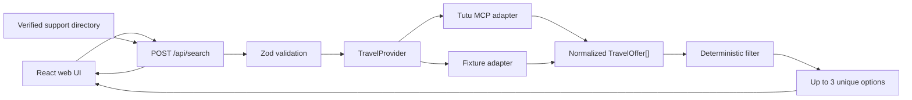

# Успеть

> Тревожная кнопка для пассажира: найти новый билет, который прибывает в нужный город до дедлайна, если исходный рейс отменили или перенесли.

«Успеть» — веб-сервис экстренного поиска нового билета после отмены или переноса рейса. Пользователь задаёт точку, где находится, время готовности к отправлению, город назначения и дедлайн. Сервис запрашивает предложения у транспортного провайдера и детерминированно оставляет до трёх разных вариантов, которые прибывают до дедлайна по расписанию.

## Бизнес-идея

### Проблема

После срыва рейса пассажир находится в стрессе и вручную сравнивает несколько несвязанных поисков: следующие самолёты, поезда, автобусы и поддержку продавца. Обычный travel-поиск оптимизирует плановую поездку, а не ответ на вопрос «как всё ещё успеть к 18:00».

### Решение

«Успеть» превращает дедлайн в главное ограничение поиска. Сервис:

1. собирает только необходимые сведения о сбое и цели поездки;
2. получает реальные транспортные предложения через Tutu MCP;
3. кодом отбрасывает всё, что отправляется слишком рано или прибывает слишком поздно;
4. показывает до трёх действительно разных альтернатив;
5. параллельно даёт проверенные контакты по исходному билету и короткий план действий.

### Для кого

- пассажиры отменённых и перенесённых авиарейсов;
- люди с жёсткой целью прибытия: пересадка, встреча, мероприятие, лечение или работа;
- сопровождающие, которые удалённо помогают родственнику перестроить поездку;
- в перспективе — сотрудники поддержки и тревел-менеджеры.

### Ценность для Туту

- новый deadline-first сценарий поверх нескольких транспортных вертикалей;
- удержание пользователя внутри одного сервиса в момент максимальной потребности;
- дополнительные продажи альтернативных билетов;
- снижение неопределённости и потенциальной нагрузки на поддержку;
- основа для встраиваемого recovery-сценария после уведомления о сбое рейса.

Ключевая метрика MVP — доля поисков, в которых пользователь открыл подходящий билет. Защитные метрики: доля пустых выдач, ошибки источника и число показанных вариантов, которые нарушили дедлайн — последнее всегда должно быть равно нулю.

## Запуск

Требуется Node.js `>=22.13.0`.

```bash
npm install
npm run dev
```

Откройте [http://localhost:3000](http://localhost:3000).

Проверки перед сдачей:

```bash
npm run lint
npm test
```

`npm test` собирает production-версию и проверяет основной сценарий, невозможный дедлайн, строгую точку отправления, отдельную оценку исходного рейса и валидацию времени.

## Что уже работает

- структурированный ввод данных о сбое и цели поездки;
- обязательное «готов отправляться не раньше»;
- самолёт, поезд, автобус, электричка и готовые составные предложения;
- строгая фильтрация по готовности, дедлайну, цене, типам транспорта и числу пересадок;
- до трёх уникальных результатов: быстрее, дешевле, меньше пересадок;
- честный пустой результат, если уложиться нельзя;
- отдельный статус исходного рейса — он не подменяет новый билет;
- проверенные контакты авиакомпании, аэропорта и продавца с официальными источниками;
- адаптивный веб-интерфейс для телефона и ноутбука.

Локальный провайдер использует воспроизводимые демо-предложения и всегда помечает их как «Демо-данные». Контракт источника изолирован интерфейсом `TravelProvider`; реальный адаптер Tutu MCP должен вернуть тот же нормализованный `TravelOffer`. Это позволяет тестировать продукт без сети и заменить источник без изменения правил отбора или UI.

## Архитектура



Главное разделение ответственности:

- MCP поставляет предложения и готовые составные маршруты, но не принимает продуктовое решение;
- детерминированный код проверяет готовность, дедлайн и остальные ограничения;
- LLM в следующих версиях может разобрать свободный текст и объяснить результат, но не решает, успевает ли пассажир;
- телефоны и ссылки берутся только из проверенного справочника, а не генерируются моделью.

Подробнее: [архитектурная документация](./docs/ARCHITECTURE.md).

## Совместная разработка

Используем упрощённый trunk-based workflow для команды из двух человек:

- `main` — только проверенная версия, которую можно показывать или разворачивать;
- `dev` — общая интеграционная ветка ближайшей версии;
- `feat/<название>` — новая функциональность от `dev`;
- `fix/<название>` — исправление от `dev`;
- `docs/<название>` — документация от `dev`.

Обычный цикл работы:

```bash
git switch dev
git pull --ff-only origin dev
git switch -c feat/tutu-mcp

# изменения, затем проверки
npm run lint
npm test

git add .
git commit -m "feat: connect Tutu MCP search"
git push -u origin feat/tutu-mcp
```

После этого создаётся pull request в `dev`. В `main` изменения попадают только через pull request из `dev`, когда версия готова к демонстрации. Не коммитим напрямую в `main`, не используем force-push и перед началом новой задачи обновляем `dev`.

Подробности и соглашения по коммитам: [CONTRIBUTING.md](./CONTRIBUTING.md).

## Документация

- [Пользовательский сценарий и границы MVP](./docs/USER_GUIDE.md)
- [Архитектура и распределение ответственности](./docs/ARCHITECTURE.md)
- [Матрица критериев хакатона](./docs/JUDGING.md)
- [Предметный словарь](./CONTEXT.md)

## Структура

```text
app/                    экран и HTTP API
data/                   демо-предложения и проверенный справочник поддержки
lib/domain.ts           входные и выходные контракты
lib/search.ts           детерминированный фильтр и выбор до трёх вариантов
lib/providers/          порт транспортного источника и локальный адаптер
tests/                  интеграционные проверки production-worker
docs/                   пользовательская и архитектурная документация
```

## Важное ограничение

«Успеть» сравнивает опубликованное расписание. MVP не рассчитывает дорогу до аэропорта или вокзала, пробки, регистрацию, досмотр, багаж, переход между точками пересадки и дорогу от вокзала или аэропорта в городе назначения. Результат означает «прибывает до дедлайна по расписанию», а не гарантию фактического прибытия.
