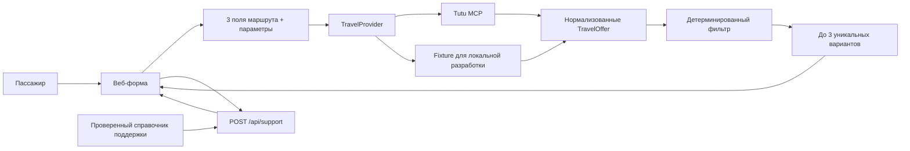

# Архитектура MVP «Успеть»

## Главный принцип

LLM может помочь понять свободный текст и объяснить уже рассчитанный результат, но не решает, успевает ли пассажир. Временные и пользовательские ограничения проверяет только детерминированный код.

## Поток запроса

1. Первый экран собирает три обязательных параметра: текущую точку, город назначения и дедлайн.
2. Второй экран собирает багаж, пассажиров, бюджет и транспорт. До кнопки «Найти варианты» транспортный источник не вызывается.
3. API повторно валидирует контракт через Zod. Время готовности в контракте равно текущему времени и не запрашивается у пользователя.
4. `TravelProvider` получает структурированный запрос и возвращает предложения без продуктового ранжирования.
5. Каждое предложение нормализуется в `TravelOffer` с абсолютными временем отправления и прибытия, ценой, сегментами и ссылкой на покупку.
6. `filterOffers` отбрасывает всё, что уже отправилось, прибывает после дедлайна или нарушает фильтры.
7. `selectRescueOptions` удаляет дубли и выбирает до трёх альтернатив по понятным категориям.
8. Если подходящих вариантов нет, `findNearestAfterDeadline` отдельно находит ближайший маршрут после дедлайна и помечает величину опоздания.
9. На четвёртом экране отдельный `POST /api/support` принимает авиакомпанию, продавца, текущую точку и необязательное время вылета. `getSupportActions()` строит до трёх действий в порядке airline → seller → location. Эти данные не влияют на поиск билетов.

## Где строгая логика

- сравнение текущего времени и отправления;
- сравнение времени прибытия и дедлайна;
- бюджет, виды транспорта и предел пересадок;
- ограничение точки отправления;
- дедупликация;
- выбор до трёх результатов;
- оценка исходного рейса при известном ожидаемом прибытии;
- сопоставление support-actions с сущностями из `support-data.json`;
- приоритет действий airline → seller → location;
- выбор URL по разрешённой цепочке полей справочника.

Эта часть не зависит от LLM и покрыта интеграционными тестами.

## Где допустим LLM

- разобрать фразу пользователя в черновик структурированных полей;
- задать вопрос по конкретному отсутствующему полю;
- кратко объяснить различия уже выбранных вариантов;
- в следующей версии превратить проверенные actions и факты в персонализированное объяснение.

Перед применением извлечённые LLM значения показываются пользователю для подтверждения. LLM не фильтрует билеты, не вычисляет дедлайн, не объединяет отдельные сегменты и не генерирует контакты.

## Источник билетов

`lib/providers/travel-provider.ts` — порт источника данных. В обычном запуске `getTravelProvider()` выбирает `TutuMcpTravelProvider`; `FixtureTravelProvider` включается только переменной `TRAVEL_PROVIDER=fixture` и используется в автоматических тестах.

`TutuMcpTravelProvider`:

- вызывается только после успешной валидации запроса;
- вызывает `search_multitransport` через Streamable HTTP JSON-RPC;
- передаёт `origin`, `destination`, `departure_date`, `adults`, `modes`, `price_max` и уровень `compact`;
- запрашивает до 30 предложений для каждой релевантной даты, максимум для трёх календарных дней;
- принимает составные маршруты только как готовые предложения Туту;
- преобразует `variants[]` в `TravelOffer` без решения «что лучше»;
- не умножает цену на пассажиров повторно: MCP возвращает сумму для всей группы;
- проверяет наличие авиатарифа с выбранным багажом, но в карточке показывает базовую цену «от»: `search_results_url` не фиксирует конкретный тариф и дополнительные услуги;
- сохраняет аэропорты/вокзалы, перевозчика, номер рейса или поезда, валюту и ссылки без домыслов;
- для авиа использует `search_results_url`, пока пользователь сравнивает варианты; для поезда, автобуса и электрички предпочитает готовый `checkout_url`;
- при сетевой ошибке возвращает явную ошибку, а не пустую выдачу;
- передаёт источник `tutu-mcp` для технической диагностики, не перегружая этим пользовательский интерфейс.

## Отказоустойчивость

- клиент и сервер валидируют ввод независимо;
- фильтрация не доверяет источнику и повторно проверяет каждое время;
- локальные тестовые данные остаются деталью провайдера и не влияют на правила отбора;
- MCP-вызов ограничен таймаутом 20 секунд;
- `search_multitransport` допускает частичный отказ одного вида транспорта и сохраняет ответы остальных;
- контрактный тест поднимает локальный mock MCP и проверяет аргументы вызова, нормализацию, ссылку и повторную фильтрацию дедлайна;
- пустой ответ и ошибка источника — разные состояния;
- URL и дата проверки хранятся только в `support-data.json`;
- неизвестная сущность создаёт directory miss, но не выдуманную ссылку;
- UI отправляет события `support_block_viewed`, `support_action_clicked` и `support_directory_miss` через локальную analytics-шину;
- production-сборка и критические сценарии запускаются одной командой `npm test`.

## Границы MVP

Не рассчитываются: геолокация, дорога до точки отправления, пробки, регистрация, досмотр, минимальная пересадка, смена аэропорта или вокзала, получение багажа и дорога до конечного адреса. Дедлайн относится к прибытию на вокзал или в аэропорт города назначения.
