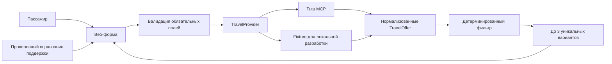

# Архитектура MVP «Успеть»

## Главный принцип

LLM может помочь понять свободный текст и объяснить уже рассчитанный результат, но не решает, успевает ли пассажир. Временные и пользовательские ограничения проверяет только детерминированный код.

## Поток запроса

1. Клиент собирает все обязательные поля. MCP до этого не вызывается.
2. API повторно валидирует контракт через Zod.
3. `TravelProvider` получает структурированный запрос и возвращает предложения без продуктового ранжирования.
4. Каждое предложение нормализуется в `TravelOffer` с абсолютными временем отправления и прибытия, ценой, сегментами и ссылкой на покупку.
5. `filterOffers` отбрасывает всё, что отправляется раньше готовности, прибывает после дедлайна или нарушает фильтры.
6. `selectRescueOptions` удаляет дубли и выбирает до трёх альтернатив по понятным категориям.
7. Контакты берутся только из проверенного справочника; генеративная модель не имеет права придумывать телефон или ссылку.

## Где строгая логика

- сравнение времени готовности и отправления;
- сравнение времени прибытия и дедлайна;
- бюджет, виды транспорта и предел пересадок;
- ограничение точки отправления;
- дедупликация;
- выбор до трёх результатов;
- оценка исходного рейса при известном ожидаемом прибытии;
- сопоставление проверенных контактов.

Эта часть не зависит от LLM и покрыта интеграционными тестами.

## Где допустим LLM

- разобрать фразу пользователя в черновик структурированных полей;
- задать вопрос по конкретному отсутствующему полю;
- кратко объяснить различия уже выбранных вариантов;
- превратить проверенный список контактов и фактов в спокойный план действий.

Перед применением извлечённые LLM значения показываются пользователю для подтверждения. LLM не фильтрует билеты, не вычисляет дедлайн, не объединяет отдельные сегменты и не генерирует контакты.

## Источник билетов

`lib/providers/travel-provider.ts` — порт источника данных. Сейчас `FixtureTravelProvider` обеспечивает стабильный локальный показ и воспроизводимые тесты. Адаптер Tutu MCP подключается в `getTravelProvider()` и обязан:

- вызывать MCP только после успешной валидации запроса;
- запрашивать самолёты, поезда, автобусы и электрички по структурированным параметрам;
- принимать составные маршруты только как готовые предложения Tutu;
- преобразовывать ответ в `TravelOffer` без решения «что лучше»;
- при сетевой ошибке возвращать явную ошибку, а не пустую выдачу;
- передавать источник `tutu-mcp`, чтобы UI показывал происхождение данных.

## Отказоустойчивость

- клиент и сервер валидируют ввод независимо;
- фильтрация не доверяет источнику и повторно проверяет каждое время;
- демо-данные визуально отделены от реальных;
- пустой ответ и ошибка источника — разные состояния;
- контакты содержат дату проверки и официальный URL;
- production-сборка и критические сценарии запускаются одной командой `npm test`.

## Границы MVP

Не рассчитываются: геолокация, дорога до точки отправления, пробки, регистрация, досмотр, минимальная пересадка, смена аэропорта или вокзала, получение багажа и дорога до конечного адреса. Дедлайн относится к прибытию на вокзал или в аэропорт города назначения.
